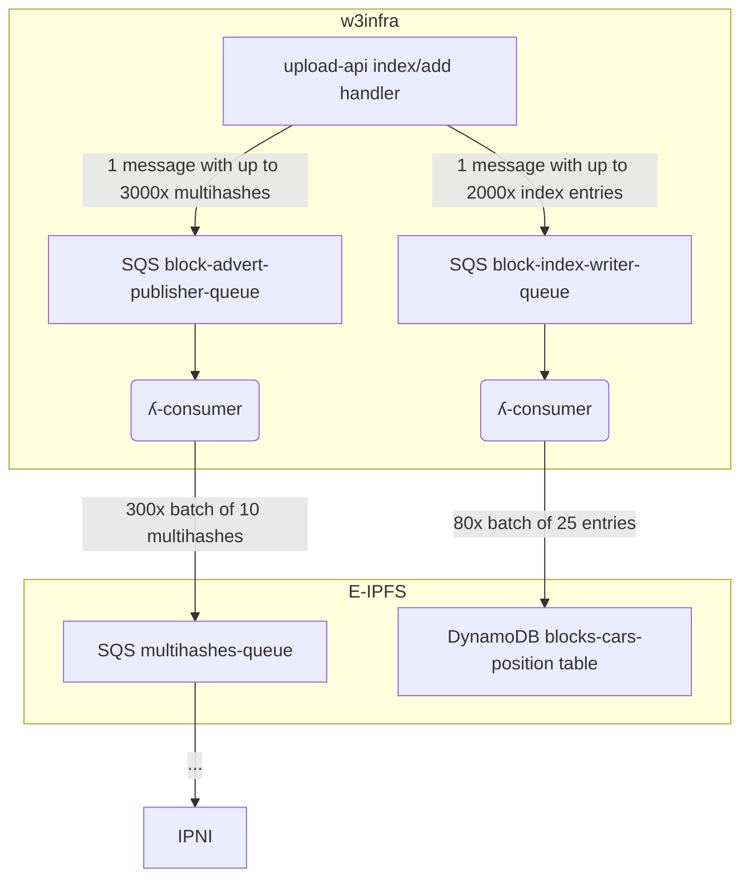

# Indexer

This stack consists of 2 queues and 2 lambda consumers. 1 queue is for IPNI and the other is for writing to DynamoDB.

Both queue consumers write to legacy E-IPFS infra. The E-IPFS `multihashes` SQS queue is the entrypoint to the IPNI pipeline. The E-IPFS `blocks-cars-position` DynamoDB table is the giant block index used (indirectly) in bitswap and the gateway.

The E-IPFS `multihashes` queue expects each message to be a single nultihash. These can be sent in batches of up to 10 (SQS limit). The `blocks-cars-position` table expects each row to be a single block (with URL and byte offset). These can be sent in batches of up to 25 (DynamoDB limit).

Due to the small batch sizes allowed it was necessary to introduce 2 extra queues, where each message to each queue contains multiple items. The lambda consumers get more runtime to consume the messages than an API Gateway (15 minutes vs 29 seconds) so they are able to feed the E-IPFS infra entrypoints without timing out.

