# Indexer

The queue consumer writes to the legacy E-IPFS `multihashes` SQS queue - the entrypoint to the IPNI pipeline.

The E-IPFS `multihashes` queue expects each message to be a single multihash. These can be sent in batches of up to 10 (SQS limit).

Due to the small batch sizes allowed it was necessary to introduce an extra queue, where each message to each queue contains multiple items. The lambda consumers get more runtime to consume the messages than an API Gateway (15 minutes vs 29 seconds) so they are able to feed the E-IPFS infra entrypoints without timing out.

```mermaid
graph TD;
  subgraph w3infra
  upload-api[upload-api index/add handler]-->|1 message with up to 3000x multihashes| block-advert-publisher-queue[SQS block-advert-publisher-queue];
  block-advert-publisher-queue-->block-advert-publisher-consumer(ʎ-consumer);
  end
  subgraph E-IPFS
  block-advert-publisher-consumer-->|300x batch of 10 multihashes| multihashes-queue[SQS multihashes-queue];
  end
  multihashes-queue-->|...| IPNI;
```

